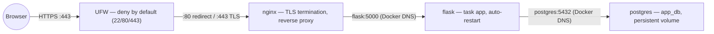

# Home Server Infrastructure Portfolio

A comprehensive infrastructure project demonstrating Linux systems administration, security hardening, full-stack application deployment, and containerization.

## Project Overview

**Four phases of real-world infrastructure:**

### Phase 1: Linux Automation Toolkit
- Automated backups with retention policy
- Log rotation and compression
- System health monitoring (CPU, memory, disk)
- Scheduled security updates

**Skills:** Bash scripting, cron scheduling, system administration

### Phase 2: Security Hardening
- UFW firewall configuration (deny-by-default)
- SSL/TLS with self-signed certificates
- Fail2ban intrusion prevention (3 failed attempts → 1 hour ban)
- SSH hardening (key-only auth, root login disabled)

**Skills:** Network security, firewall rules, authentication, threat mitigation, defense-in-depth

### Phase 3: Full-Stack Deployment
- Flask web application (Python)
- PostgreSQL database
- Nginx reverse proxy (HTTPS → Flask)
- Systemd service management

**Skills:** Application deployment, database integration, reverse proxy configuration, service management

### Phase 4: Docker Containerization
- Containerized Flask, PostgreSQL, Nginx with Docker
- docker-compose orchestration
- Container networking and volume management
- Credentials management via environment variables

**Skills:** Containerization, orchestration, Docker, docker-compose, infrastructure as code

## Architecture

**Full Stack (Phase 4 - Current):**



**Full diagrams, port-exposure map, and secrets flow:** [`docs/architecture.md`](docs/architecture.md)


**Container Networking:**
- All containers on `home-server-net` bridge network
- Docker-managed DNS resolution by container name
- Volume mounts for PostgreSQL persistence
- Auto-restart policy on container failure

## Key Technologies

- **OS:** Ubuntu 26.04 LTS
- **Containerization:** Docker, docker-compose
- **Scripting:** Bash
- **Web:** Flask, Nginx, Werkzeug
- **Database:** PostgreSQL
- **Security:** UFW, Fail2ban, OpenSSH, SSL/TLS
- **Process Management:** systemd, docker-compose restart policies
- **Version Control:** Git

## Project Structure

home-server-infrastructure/
├── README.md
├── docker-compose.yml # Orchestrates all containers
├── .env # Credentials (git-ignored)
├── docker-container-files/
│ ├── flask/ # Flask app Dockerfile + source
│ ├── postgres/ # PostgreSQL Dockerfile + init.sql
│ └── nginx/ # Nginx config
├── backups/ # Backup scripts
├── logs/ # Log rotation scripts
├── monitoring/ # System health monitoring
├── updates/ # Automated security updates
├── security/ # Security configs and docs
├── deployment/ # Deployment guides
└── docs/ # Architecture diagrams


## What I Learned

- **Linux Systems:** User management, permissions, cron, systemd, service management
- **Security:** Defense-in-depth, firewall rules, certificate management, intrusion detection, least privilege principle
- **Containerization:** Docker images, container networking, volume management, environment variables
- **Orchestration:** docker-compose coordination of multiple services, service dependencies, health checks
- **DevOps:** Reverse proxy configuration, database integration, container auto-restart, persistent data management
- **Problem-Solving:** Python version compatibility (psycopg2/3 migration), PostgreSQL init script context handling, Docker networking between containers
- **Infrastructure:** Full-stack application deployment, security layers, production best practices

## How to Review

1. **Architecture:** Start with [`docs/architecture.md`](docs/architecture.md) — diagrams, port map, secrets flow — then the troubleshooting log [`docs/lessons-learned.md`](docs/lessons-learned.md)
2. **Phase 1-3 Overview:** Read the docs in `security/` (incl. `firewall-rules.md`), `deployment/`, and `setup/` directories
3. **Phase 1 Scripts:** Review shell scripts in `backups/`, `logs/`, `monitoring/`, `updates/`
4. **Phase 4 Containerization:** Review `docker-compose.yml`, Dockerfiles in `docker-container-files/`
5. **Run It Yourself:** Follow the Quick Start below to deploy locally

## Quick Start

Prerequisites: Ubuntu 26.04 LTS, Docker, docker-compose installed

```bash
# Clone the repository
git clone https://github.com/kiranm04ru-sketch/home-server-infrastructure.git
cd home-server-infrastructure

# Create .env file with your credentials (TEMPLATE)
cat > .env << 'DOTENV'
POSTGRES_USER=your_user
POSTGRES_PASSWORD=your_password
POSTGRES_DB=your_db
PGUSER=your_username
PGPASSWORD=your_password
PGDATABASE=your_db
PGHOST=postgres
DOTENV

# NOTE: if your shell exports PGHOST/PGPASSWORD etc. (e.g. an old
# `export PGPASSWORD=...` in ~/.bashrc), docker compose silently prefers
# those over .env. Check what the containers will actually receive with
# `docker compose config | grep PG` — see docs/lessons-learned.md.

# Start all containers
docker compose up

# Access the app
# Browser: https://localhost (self-signed cert warning is normal)
# Health check: curl -k https://localhost/health
```

## Next Steps

- Phase 5: Kubernetes single-node cluster deployment — plan: [`docs/phase5-kubernetes-plan.md`](docs/phase5-kubernetes-plan.md)
- Phase 6: Prometheus + Grafana monitoring and logging
- Phase 7: Deploy self-hosted service (Nextcloud, Jellyfin, etc.)

---

**Tested and working on Ubuntu 26.04 LTS** (also compatible with recent Ubuntu versions 22.04+)

**Repository:** [github.com/kiranm04ru-sketch/home-server-infrastructure](https://github.com/kiranm04ru-sketch/home-server-infrastructure)
