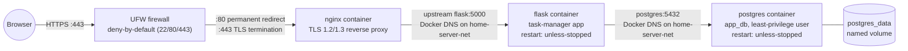
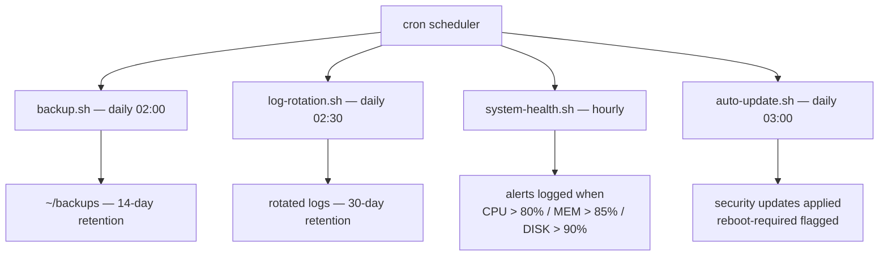
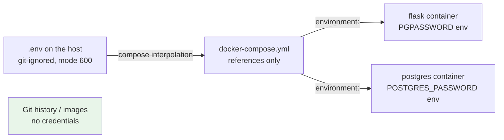

# System Architecture

One Ubuntu 26.04 LTS host (daily-driver laptop, 20 cores / 14 GiB RAM) running
four phases of infrastructure, from bare-metal automation to containerized
services.

## Full Stack (Phase 4 — current)

**Request lifecycle:** browser → UFW (only 80/443 pass) → nginx (80 redirects to
443; 443 terminates TLS and proxies) → flask (business logic) → postgres (SQL
over the internal bridge network). Responses reverse the path.

## Phase 1: Host Automation (still active under everything)

## Port Exposure

Only three ports face the network. Debug surfaces stay on loopback — see
`security/firewall-rules.md` for why (Docker's published ports bypass UFW).

| Port | Process | Bound to | Reachable from |
|---|---|---|---|
| 22 | host `sshd` | all interfaces | LAN (UFW-allowed; key-only + fail2ban) |
| 80 | nginx container | all interfaces | LAN — redirect to HTTPS only |
| 443 | nginx container | all interfaces | LAN — the single app entry point |
| 5000 | flask container | `127.0.0.1` only | host (debug; bypasses TLS intentionally) |
| 5432 | postgres container | `127.0.0.1` only | host (psql debugging) |

Container-to-container traffic never touches the host ports above: nginx and
flask reach each other by service name over the `home-server-net` bridge.

## Secrets Flow

The postgres image build contains no credentials — the Dockerfile only layers
`init.sql` on the official `postgres:16` base; all secrets are injected at
runtime from `.env` (see the repo's Quick Start for the template).

## Security Layers (defense in depth)

1. **UFW** — deny-by-default; 22/80/443 only
2. **Fail2ban** — bans repeated SSH failures (3 in 10 min → 1 hour)
3. **TLS 1.2+** — encrypted transport; HTTP permanently redirects
4. **Least privilege** — app DB user owns only `app_db`; root login disabled;
   key-only SSH; debug ports loopback-only

## Component Responsibilities

| Component | Image | Role |
|---|---|---|
| nginx | `nginx:latest` + custom `nginx.conf` | TLS termination, reverse proxy, HTTP→HTTPS redirect |
| flask | custom (Python 3.14 base) | Task-manager app; serves UI + JSON API |
| postgres | `postgres:16` + `init.sql` | Relational storage; `tasks` table; persistent named volume |
| host cron scripts | bash | Backups, log rotation, health alerts, security updates |

## Looking Ahead

Phase 5 replaces the compose topology with a single-node k3s cluster
(`docs/phase5-kubernetes-plan.md`); this file will gain the cluster diagram
when that lands.
